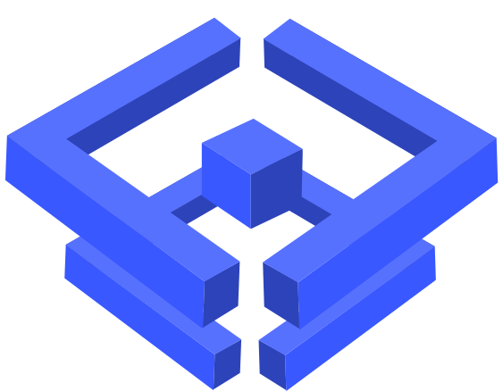

<p align="center"><a href="#"></a></p>

<br/>
<h1 align="center">Shartube</h1>
<p align="center">Online sharing platform</p>

# What is Shartube

Shartue is a social networking platform that allows users to share stories and videos, and users can interact with each other by messaging and emotional interactions.

## Environment Variables

To run this project, you will need to add the following environment variables to your .env file

`DB_HOST`
`DB_PORT`
`DB_USERNAME`
`DB_PASSWORD`
`DB_NAME`
`JWT_SECRET`

## Run Locally

Clone the project, or download as zip.

### Frontend

If you want to run web application, please visit here.

## **Web application**

```text {"id":"01J2AWZ2VT0XM7MY1SPAQTFWH3"}
cd web

```

> In this project we are using yarn. Before you do the next steps if you haven't downloaded yarn do the following.

<details close>

  <summary>Install <b>yarn</b></summary>
  <br/>

```sh {"id":"01J2AWZ2VT0XM7MY1SPCJ8SHMK"}
npm i -g yarn

```

</details>

Install all dependencies and run dev command.

<br/>

```text {"id":"01J2AWZ2VT0XM7MY1SPD11XR1S"}
yarn dev

```

If you wanna build

```sh {"id":"01J2AWZ2VT0XM7MY1SPGSJMRS1"}
yarn build

```

This is where you want to run your mobile app.

## **Mobile app**

Firstly

```sh {"id":"01J2AWZ2VT0XM7MY1SPKCV0Y7Q"}
cd app/mobile

```

Make sure you have downloaded all package dependencies

Check it out `package.json`

**Android**

```sh {"id":"01J2AWZ2VT0XM7MY1SPP7VJ0P7"}
yarn android

```

**IOS**

```text {"id":"01J2AWZ2VV87JBQ9DH6QAJSQE7"}
yarn ios

```

**Web**

```text {"id":"01J2AWZ2VV87JBQ9DH6TR5N01A"}
yarn web

```

### Backend

```bash {"id":"01J2AWZ2VV87JBQ9DH6X6P9WJK"}
  git clone https://github.com/Folody-Team/Shartube/

```

- 1. Go to the project directory

```bash {"id":"01J2AWZ2VV87JBQ9DH6YJ0FV2G"}
  cd Shartube
  cd server

```

- 2. fill the env

- 3. Start the server

```bash {"id":"01J2AWZ2VV87JBQ9DH721Y9J7V"}
docker compose up --build

```

Make sure you installed [**Golang**](https://go.dev/), [**NodeJs**](https://nodejs.org/).

## Tech Stack

**Client:** Next.js, React, Redux, TailwindCSS,...

**Server:** Golang, Mux, Net/http,...

## Support

For support, [join our Discord server](https://discord.gg/BbKvjwsYwM).

## Contributing

Pull requests are welcome. For major changes, please open an issue first to discuss what you would like to change.

Please make sure to update tests as appropriate.

## Stargazers

[](https://github.com/Folody-Team/Shartube/stargazers)

<p align="center"><a href="#"></a></p>

